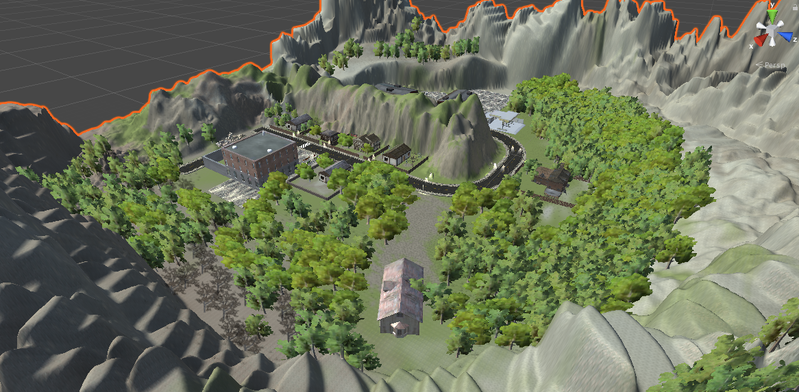
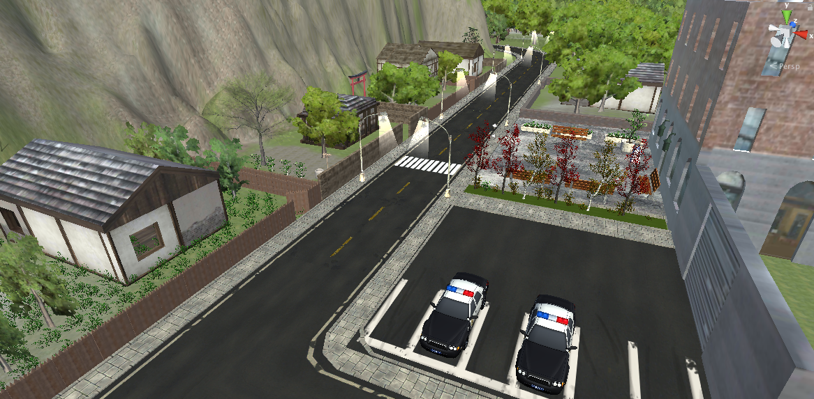
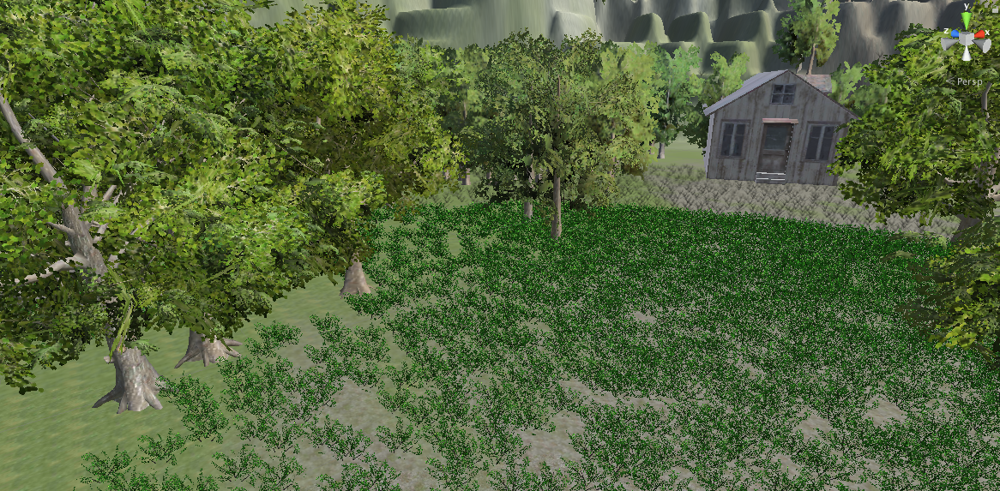
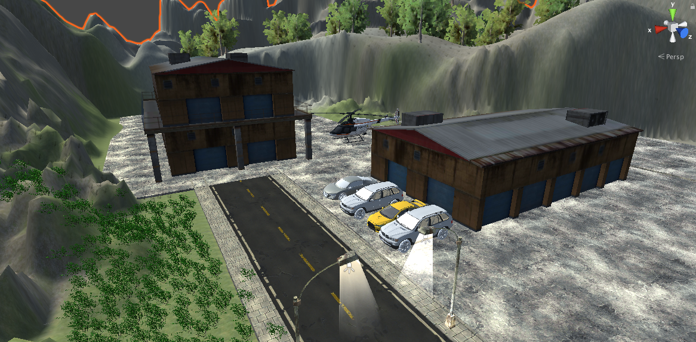

<h1 align="center">
   
  
</h1>

<h4 align="center">
  Implementation of an Virtual Reality (VR) game for the
  subject Intelligent Interfaces of the Computer Science &
  engineering degree at La Laguna University (
  <a href="http://www.ull.es" target="_blank">ULL</a>
  )
</h4>

  <a href="#description">Description</a> •
  <a href="#characters">Characters</a> •
  <a href="#scenes">Scenes</a> •
  <a href="#controls">Controls</a> •
  <a href="#virtual reality recomendations">Virtual Reality</a> •
  <a href="#problems">Problems</a> •
  <a href="#authors">Authors</a>

## Description
The inspiration behind this virtual reality game are the
classical detective stories where the user has to solve
a crime collecting each of the clues that are spread out
of the map, and at the same time tries to avoid the
enemies.

## Characters

### Main character (*First person*)
The player of the videogame becomes the detective that
has to solve the crime. As it is a virtual reality game
it is really convenient to adapt the different scenes
to the point of view of the main character.

### Enemies
The enemies are the ones that commited the crime. they
are initially placed on the abandoned factory, but when we
start the scene, they are going to try to follow the main
player thought the map. We need to avoid them because if
they collide with us, we automatically lose the game.

## Scenes

In this videogame it is really important to create a good
level of inmersion, so we have to do a really difficult
job of creating both of the two scenes.

### First Scene (*The morgue*)
The videogame starts with this scene. The player feels
inmersed in *the morgue*, the place where the dead body is
placed.

In this scene we talk with our police workmate (chatbot), who
explains us what has happened in the crime and what we have to do
solve it.

### Second Scene (*The village*)
After knowing that we have to collect all the clues to
solve the crime, we are introduced to the main scene of
the game. This is the landscape of the village where all
the game is set.

In the design of the scene we focus on the thriller
atmosphere that we wanted to create. We sat the police
station and the main street of the village. creating
an accurate representation of an street with paviment,
roads, traffic lights, rubbish bins,...

Also, it was important to create the different houses of
the village. Those houses were decorated with garden and
other elements.

We also placed a house on the forest, where it was located
one of the clues of the crime. This house was less accesible,
with the aim of adding difficulty to the game. The house was
also well ambiented, placing the clue on the side of it.

One of the main parts of the scene is the abandoned factory.
In this part of the map is where the enemies are initially
located and also where other clue is placed. With this, we
tried to add difficulty to the game, so you have to go to
the place where the enemies are to collect all the clues.

## Controls
To control the execution of the game we added a **Playstation
3 controller**. With this gamepad we can control the movement
of the main character throught the map. and with the movement
of our head we can control the vision point.

The playstation controls used in the game are the following:

Playstation button | Action
------------------ | ------
Game pad move | Movement of the player throught the map.
Square :black_square: | Show inventory
L1 | Interaction with the chatbot police (*morgue scene*)
L2 | Interaction with the chatbot police (*morgue scene*)

## Programming landmarks

1. **Complex models and landscapes**: We added moving models (enemies)
and complex scene ambientation.
2. **Complex character actions**: Characters interact with different
scene elements and generate particle systems, for example when we add
a clue to the inventory.
3. **Characters variety**: We added different types of characters,
such as the enemies and the police chatbox, which generate different
results depending on the interaction.
4. **development complexity**: we added a `GameController` class to
manage all the events genrated by the complex interactions between
the characters.
5. **Inmersion**: We deeply took care of the videogame inmersion,
adding complex elements such as music ambience.
6. **VR Interaction**: To enhance the vr interaction we added a
Playstation 3 gamepad.
7. **Chatbot**: The police workmate that explains the story and
the objectives to the main player is implemented as ChatBot with
**DialogFlow**.
7. **Sensors**: Microphone, acelerometer and gyroscope
interaction
was added in previous assignments. Check out:
[Intelligent interfaces
assignments](https://github.com/AlberTJ97/LearningUnity)

## Virtual reality recomendations
The virtual reality recomendations that we have followed
are:

* The user has the control of the movement of the player,
with the gamepad and with the movement of the head.
* Use of a reticle.
* Included visual and audio effects, as well as ambience
music.
* The distance between the player and the user interfaces
 is optimal (3m)

## Execution
 <h3 align="center">
   <a href="https://youtu.be/EnRX9OnB2oQ">
     Execution (YouTube :video_game:)
   </a>
 </h3>

## Tasks division
To commit this project we have to conduct the following tasks:

- [x] Story creation: @AlberTJ97
- [x] Story script: @CristianAbrante
- [x] Morgue Scene ambientation: @CristianAbrante
- [x] Village Scene ambienatation: @CristianAbrante
- [x] ChatBot implementation: @AlberTJ97
- [x] ChatBot interaction: @AlberTJ97
- [x] VR assests: @AlberTJ97
- [x] Gamepad interaction: @AlberTJ97
- [x] Inventory implementation: @AlberTJ97
- [x] Enemies implementation: @CristianAbrante

## Problems
The issues that we have faced during the development of the
videogame are the following:

* **Find accurate assets**: Our videogame requires a good level
of ambientation, so finding assets adjusted to the story is really
difficult, considering our zero budget.
* **Execution of unity**: Unity requires a lot of computational
resources to work well with heavy projects (like ours). As we do not
have mutch powerful computers it was really difficult to complete
the scenes.
* **Collaborate in the project**: Unity is not fully integrated with
github and other version control systems, so working symultaneously
in such a large project was really diffcult.

## Future lines
Th future lines of development are:

- [ ] Create better ambientation with more accurate assets.
- [ ] Create more intelligent enemies, and different types.
- [ ] Create a more complex story, with mores scenes and characters.

## Authors
* **Alberto Jesús González Álvarez** -  [AlberTJ97](https://github.com/AlberTJ97)
* **Cristian Abrante Dorta** - [CristianAbrante](https://github.com/CristianAbrante)
